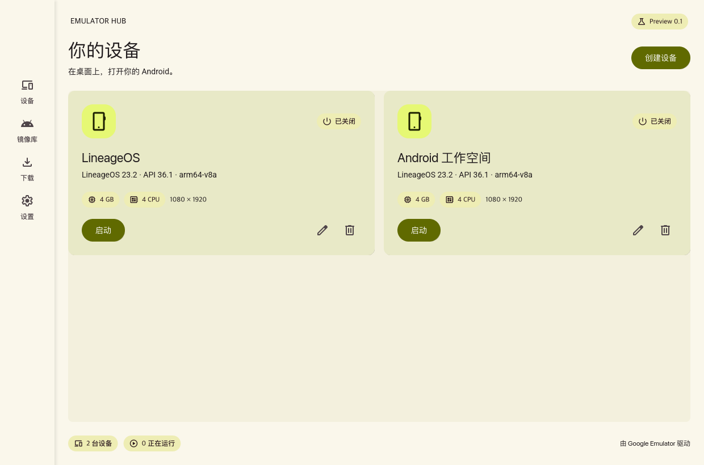

# Emulator Hub

A native Material 3 Android desktop, built with Rust, [material-ui-rs](https://github.com/moeleak/material-ui-rs), and Google Android Emulator. Custom LineageOS images and Google SDK images share one library, with isolated data and snapshots for each device.



*UI preview rendered from the application's widgets with example devices.*

Emulator Hub is a **preview**. Host support is Windows x86_64, Linux x86_64, and macOS x86_64/Apple Silicon. Guests match the host CPU: x86_64 or arm64-v8a. ARM-only APK translation on x86_64 hosts is outside this release.

[Download the preview](https://github.com/moeleak/emulator-hub/releases) for native installers, portable archives, and SHA256 checksums. See the [validation record](docs/validation.md) for tested host/guest combinations.

Linux release artifacts target glibc 2.35 or newer. On NixOS, the flake supplies the matching runtime environment.

## Develop

```sh
git clone https://github.com/moeleak/emulator-hub
cd emulator-hub
nix develop
cargo run -p emulator-hub
```

The flake pins the toolchain and native libraries. Linux and macOS use Nix; Windows builds use the same Rust version from `rust-toolchain.toml`, Visual Studio Build Tools, and the Windows SDK. WSL can use the Linux Nix shell, while a Windows emulator runs natively with WHPX.

For native Windows development, use `cargo run -p emulator-hub --target x86_64-pc-windows-msvc`. The target configuration links the MSVC C runtime into the desktop executable, and packaging checks its final PE dependencies. Downloaded emulator engines have their own runtime dependencies and notices.

On NixOS, use `nix run .` to start the application inside its FHS runtime. This also supplies the loader and libraries needed by downloaded Emulator/ADB binaries. For development, build with `nix develop --command cargo build -p emulator-hub`, then run `nix run .#runtime -- -c './target/debug/emulator-hub'`. `nix build .#native` produces the unwrapped application.

```sh
nix develop --command cargo fmt --all -- --check
nix develop --command cargo test --workspace
nix develop --command cargo clippy --workspace --all-targets -- -D warnings
nix build
```

`nix develop .#engine` provides Google Emulator build tooling. `nix develop .#android` provides Android source-management tools; on Linux, `nix run .#android-env` opens the Android/kernel FHS build environment. The corresponding source trees live in separate repositories rather than in this desktop workspace.

## Use

1. Open **Settings → Emulator engine** to install the published source-built engine and ADB. You can explicitly select Google official tools or existing local executables. Google package licenses are shown before installation.
2. Open **Images**, choose a compatible image, and download it. The library also accepts a local SDK system-image ZIP or a custom HTTPS Hub JSON / SDK XML repository.
3. Create a device with its own memory, CPU, display, writable storage, and AVD directory.
4. Start the device. Click the embedded display for keyboard and mouse input. The toolbar provides power/wake, Android navigation, APK installation, clipboard transfer, screenshots, and a manual snapshot. Scroll the toolbar to reach additional controls in a compact window.

The app defaults to Simplified Chinese, with English, light/dark/system appearance in Settings. It registers Roboto, Material Symbols, and bundled Noto Sans SC fonts.

Every image archive is checked against its source's digest and size. Interrupted downloads resume; path traversal and archive links are rejected. Installed images are shared read-only. A device pins an image and engine; installing a newer version does not overwrite existing device data or snapshots.

Use `EMULATOR_HUB_HOME=/absolute/path` for a separate workspace. Application state and preferences live there, including `sources.json`, `images/`, `instances/`, and `engines/`. Per-device `emulator.log` files contain startup diagnostics. Deleting a device removes its user data and snapshots after confirmation.

## Source and image repositories

| Repository | Contents |
| --- | --- |
| [lineageos-avd/android](https://github.com/lineageos-avd/android/tree/avd-main) | Locked system/kernel manifests, build orchestration, image catalog and releases |
| [android_device_generic_goldfish](https://github.com/lineageos-avd/android_device_generic_goldfish) | Ranchu device changes |
| [android_vendor_lineage](https://github.com/lineageos-avd/android_vendor_lineage) | Lineage product configuration and bundled KernelSU Manager |
| [android_kernel_common](https://github.com/lineageos-avd/android_kernel_common) | Android 16 / Linux 6.12 kernel fork |
| [KernelSU-Next](https://github.com/lineageos-avd/KernelSU-Next) | KernelSU emulator integration |
| [android-emulator](https://github.com/lineageos-avd/android-emulator) | Pinned Google Emulator source recipe, builds and engine catalog |

The [imported r3 image release](https://github.com/lineageos-avd/android/releases/tag/lab-import-r3) preserves the existing LineageOS 23.2 / Android 16 (API 36.1) ARM64 and x86_64 archives, Linux 6.12.89, and KernelSU-Next v3.3.0. Its hashes match the Lab artifacts. Imported images are distinguished from later manifest-driven rebuilds; no claim of bit-for-bit reproduction is made for the original build.

The default image catalog now serves [revision 4](https://github.com/lineageos-avd/android/releases/tag/lineage-23.2-r4), rebuilt for both architectures by the pinned kernel/system Actions workflow. Both images passed guest validation with the published source-built emulator, and the ARM64 archive passed the Hub's actual remote download and installation flow.

Google Emulator's public `emu-36-1-release` source baseline is separately versioned from the latest Google SDK binary downloads. The source-built catalog only advertises completed artifacts. If a host build is not yet published, installation reports that state instead of substituting another engine.

The [source-built SDK release](https://github.com/lineageos-avd/android-emulator/releases/tag/source-35.3.8-preview.1) includes binaries, exact manifests, build and package validation, corresponding source archives, and checksums. Hub reads its platform packages through the maintained engine catalog.

## Architecture and interfaces

- `hub-core`: catalog adapters, verified/resumable downloads, safe extraction, persistent images and private AVDs.
- `hub-engine`: pinned upstream protobuf, authenticated localhost gRPC, process/port ownership, ADB, display and input, snapshots, and engine provisioning.
- `emulator-hub`: iced/material-ui-rs application, asynchronous operations, aspect-ratio-correct input mapping, and latest-frame rendering.

The emulator is an independent child process. Frames use RGBA over gRPC; only the latest frame reaches the desktop renderer. User input is ordered, and held input is released when the display loses focus. Google Emulator supplies virtualization, rendering, audio and Android control; Hub manages their desktop lifecycle.

The catalog contract is documented in [docs/catalogs.md](docs/catalogs.md). It is data-only; adding a source does not execute provider scripts.

For headless administration, `cargo run -p hub-core --example manage -- --help` exposes the same catalog, local import, instance creation and listing operations. `cargo run -p hub-engine --example smoke -- --image-dir <image-directory> --emulator <executable> --adb <executable>` creates a private temporary AVD and checks boot, display, input, clipboard, ADB and snapshots.

## Builds and validation

GitHub Actions checks Rust code and builds four native targets. Release workflows produce Windows installers/portable ZIPs, macOS DMGs, and Linux AppImages/archives. System/kernel builds run on the dedicated Lab Nix builder from pinned manifests. Google Emulator has its own four-host source-build workflow.

Linux KVM and a physical Apple Silicon Mac are the initial hardware-acceleration validation targets. Windows and Intel Mac artifacts remain preview targets until their acceleration tests are recorded. A successful build alone does not establish runtime compatibility.

The app is Apache-2.0. Embedded dependencies and fonts retain their licenses. Google SDK components are downloaded from Google under their displayed terms; source-built engine releases carry their own notices and corresponding source information.

`THIRD_PARTY_NOTICES.txt` accompanies distributed packages. Regenerate it after dependency updates with `nix develop --command python3 scripts/generate-notices.py`; license files absent from published crates are cached from their exact source revisions under `licenses/`, with provenance and SHA256 values.
